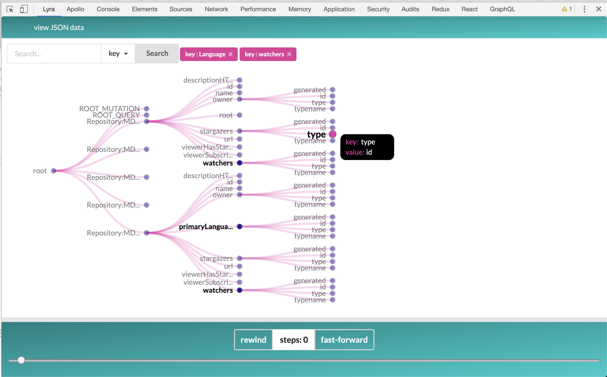

  
  <h1 align="center">Lyra (beta) </h1>

## How it works

Download Lyra from the Chrome Web Store and open the extension on the tab that hosts an Apollo Client application. **Note**: you must have the Apollo Client Devtools installed and activated before using Lyra, as the latter relies on data supplied by the Apollo Client Devtool’s global hook.

Once initialized, the extension injects a script that reads data stored in Apollo cache into the user’s app. Using a Mutation Observer instance, Lyra tracks changes to DOM nodes, triggering a reinjection of the script, which reads new data from the cache, and passes it to the devtool panel using the Chrome message passing API. The extension then displays data as an interactive D3 tree.

### Features:

- search the cache by key and value (support for multiple search terms) and see highlighted results
- toggle visibility of nodes
- hover on nodes to display values
- view the normalized Apollo Client cache in JSON format

## Developers (Chrome):

1. download the source code, go to `chrome://extensions` and toggle developer mode on (top left corner); click `Load unpacked` and select the `browser` down folder.
2. run `npm run chrome` in the devtools repo. Webpack will watch the files and rebundle them automatically if you make any changes. To see your changes, close the Chrome devtool panel and reopen to see your changes in effect (no need to reload the extension in chrome://extensions, note that you will need to reload if you make changes to the extension manifest).
